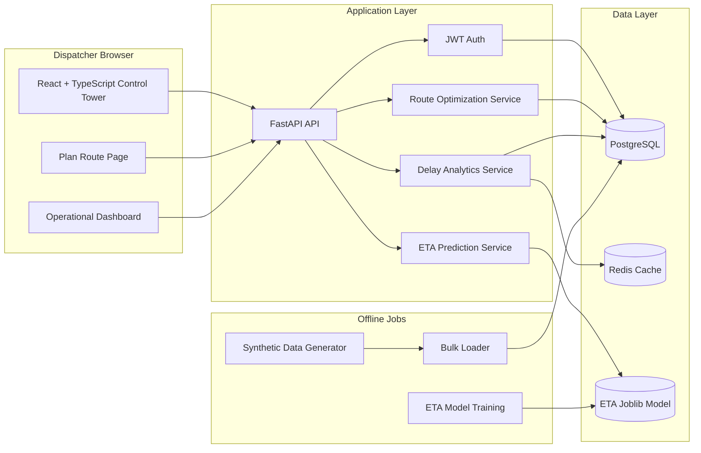

# AI Logistics Control Tower

[](https://fastapi.tiangolo.com/)
[](https://www.python.org/)
[](https://www.postgresql.org/)
[](https://redis.io/)
[](https://react.dev/)
[](https://www.typescriptlang.org/)
[](https://vite.dev/)
[](https://tailwindcss.com/)
[](https://www.docker.com/)

A production-shaped monorepo for an AI Logistics Control Tower. The backend exposes logistics APIs for route optimization, ETA prediction, and delay analytics, while the frontend provides a dispatcher-focused dashboard and a route-planning experience built around map interaction and optimization feedback.

## Architecture



## Repository Layout

- `backend/` FastAPI service, SQLAlchemy models, Pydantic schemas, Alembic migrations, and utility scripts
- `frontend/` React 18 + TypeScript app with Tailwind CSS, React Query, and Leaflet-based routing UX
- `docker-compose.yml` Local orchestration for PostgreSQL, Redis, backend, and frontend
- `README.md` Project overview and setup guide

## Key Results

The project exposes the core metrics in code and API responses, but this repository does not currently persist a benchmark artifact or CI report snapshot. The values below should be filled from the latest benchmark or test run.

- Route optimization savings: `TBD` percentage versus the naive sequential route
- ETA prediction accuracy: `TBD` based on the latest model evaluation output from `backend/scripts/train_eta_model.py`
- Delay detection precision: `TBD` from the delay analytics validation run

If you have the benchmark outputs, place them here in a fixed format such as:

- Route optimization savings: `42.8%`
- ETA prediction accuracy: `MAE 8.6 min` or `R² 0.91`
- Delay detection precision: `0.87`

## Screenshots

Add screenshots of the major user flows here once they are captured.

### Dashboard


### Plan Route


### Route Optimization Result


## Setup

### Prerequisites

- Python 3.11
- Node.js 18 or newer
- Docker Desktop or Docker Engine + Compose

### 1. Start the full stack with Docker

```bash
docker compose up --build
```

This starts:

- Frontend: http://localhost:5173
- Backend API: http://localhost:8000
- API health: http://localhost:8000/api/health

### 2. Run the backend locally

```bash
cd backend
python -m venv .venv
.venv\Scripts\activate
pip install -r requirements.txt
uvicorn app.main:app --reload --host 0.0.0.0 --port 8000
```

### 3. Run the frontend locally

```bash
cd frontend
npm install
npm run dev
```

## Environment Variables

Backend configuration is centralized in `backend/app/core/config.py`.

- `DATABASE_URL` SQLAlchemy async connection string for PostgreSQL
- `REDIS_URL` Redis connection string for analytics caching
- `BACKEND_CORS_ORIGINS` Comma-separated list of allowed frontend origins
- `ETA_MODEL_PATH` Path to the persisted ETA model artifact
- `ANALYTICS_CACHE_TTL_SECONDS` Redis cache TTL for delay analytics responses
- `VITE_API_BASE_URL` Frontend API base URL used at build time

## Backend Workflows

### Generate synthetic logistics data

```bash
cd backend
python scripts/generate_synthetic_logistics_data.py
```

### Load synthetic data into PostgreSQL

```bash
cd backend
python scripts/load_synthetic_logistics_data.py --truncate
```

### Train the ETA prediction model

```bash
cd backend
python scripts/train_eta_model.py
```

### API endpoints

- `POST /api/auth/register`
- `POST /api/auth/login`
- `POST /api/auth/refresh`
- `GET /api/auth/me`
- `POST /api/predict-eta`
- `POST /api/optimize-route`
- `POST /api/analytics/delays`
- `GET /api/health`

## Frontend Highlights

- Dispatcher-focused route planning with map clicks and address search
- Live route comparison with naive versus optimized metrics
- Map rendering with Leaflet and OpenStreetMap tiles
- Dashboard panels for fleet state, shipment data, and analytics
- Skeleton loaders for asynchronous views

## Notes

- The route optimization service uses OR-Tools when available and falls back to a nearest-neighbor heuristic if solving times out or the solver is unavailable.
- The analytics endpoint caches repeated requests in Redis to keep the dashboard responsive.
- The ETA training script writes both a `joblib` model artifact and a companion metrics JSON file next to it.
- This repository is structured to support local development first, but the layout is suitable for containerized deployment and future CI integration.
